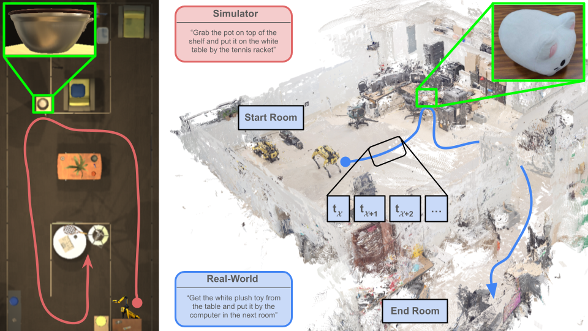

<div align="center">
  <h1>LAMBDA (λ) Benchmark</h1>
</div>
<p align="center">
  Under IROS Review 
  <br>
  <a href="https://lambdabenchmark.github.io/">Website</a> |
  <a href="https://arxiv.org/abs/2412.05313">arXiv</a> |
  <!-- <a href="">Model Checkpoints</a> | -->
  <a href="https://www.dropbox.com/scl/fo/c1q9s420pzu1285t1wcud/AGMDPvgD5R1ilUFId0i94KE?rlkey=7lwmxnjagi7k9kgimd4v7fwaq&dl=0">Dataset</a> |
  <a href="https://github.com/h2r/LaNPM-Dataset/blob/main/DataCard.md">Data Card</a>
</p>

##



Learning to execute long-horizon mobile manipulation tasks is crucial for advancing robotics in household and workplace settings. However, current approaches are typically data-inefficient, underscoring the need for improved models that require realistically sized benchmarks to evaluate their efficiency. To address this, we introduce the LAMBDA (λ) benchmark––Long-horizon Actions for Mobile-manipulation Benchmarking of Directed Activities––which evaluates the data efficiency of models on language-conditioned, long-horizon, multi-room, multi-floor, pick-and-place tasks using a dataset of manageable size, more feasible for collection. Our benchmark includes 571 human-collected demonstrations that provide realism and diversity in simulated and real-world settings. Unlike planner-generated data, these trajectories offer natural variability and replay-verifiability, ensuring robust learning and evaluation. We leverage LAMBDA to benchmark current end-to-end learning methods and a modular neuro-symbolic approaches that combines foundation models with task and motion planning. We find that end-to-end methods—even when pretrained—yield lower success rates, while neuro-symbolic methods perform significantly better and require less data.

## Dataset Format 🗂️
More detailed dataset information can be found in the dataset card [DataCard.md](https://github.com/h2r/LaNPM-Dataset/blob/main/DataCard.md#lanmp).

Download the dataset from this [DropBox](https://www.dropbox.com/scl/fo/c1q9s420pzu1285t1wcud/AGMDPvgD5R1ilUFId0i94KE?rlkey=7lwmxnjagi7k9kgimd4v7fwaq&dl=0).

Code that opens, reads, and displays the dataset contents can be found in this [Google Colab notebook](https://colab.research.google.com/drive/18fTkjqcvlyOkCkbou6LK2RG2XKsPT__K?usp=sharing).

### Sim Dataset
The simulation dataset comes in a single hdf5 file, and has the following hierarchy:
```
sim_dataset.hdf5/
├── data_11:11:28/
│   ├── folder_0
│   ├── folder_1
│   └── folder_2
├── data_11:14:08/
│   ├── folder_0
│   └── ...
└── ...
```

Under each folder, there are three main numpy files: `depth_<num>`, `inst_seg_<num>`, and `rgb_<num>`,
which correspond to the depth image, segmentation image, and rgb image, respectively.

There is also a json file which includes dumped metadata for that time step.
The detailed metadata can be found in the dataset card.

<!-- | key | description | value |
|---|---|---|
| sim_time | Simulation time from game start | 0.1852477639913559 |
| wall-clock_time | Wall clock time at the step | 15:10:47.900 |
| action | Discrete Action to be executed | Initialize |
| state_body | State of the body, in x, y, z, and yaw. | [3.0, 0.9009992480278015, -4.5, 269.9995422363281] |
| state_ee | End Effector state, in x, y, z, roll, pitch, yaw. | [2.5999975204467773, 0.8979992270469666, -4.171003341674805, -1.9440563492718068e-07, -1.2731799533306385, 1.9440386333307377e-07] |
| held_objs | list of held objects | [] |
| held_objs_state | list of state of held objects | {} |
| inst_det2D | Object Detection Data | {"keys": ["Wall_4\|0.98\|1.298\|-2.63", "Wall_3\|5.43\|1.298\|-5.218", "RemoteControl\|+01.15\|+00.48\|-04.24", "AlarmClock\|+01.31\|+00.48\|-04.01", "wall_panel_32_5 (14)\|1.978\|0\|-4.912", "wall_panel_32_5 (12)\|1\|0\|-3.934", "wall_panel_32_5 (27)\|1.977441\|0\|-3.787738", "wall_panel_32_5 (26)\|1\|0\|-3.787738", "wall_panel_32_5 (11)\|1\|0\|-2.956", "wall_panel_32_5 (13)\|1\|0\|-4.912", "SideTable\|+01.21\|+00.00\|-04.25", "RoboTHOR_Ceiling\|0\|0\|0"], "values": [[418, 43, 1139, 220], [315, 0, 417, 113], [728, 715, 760, 719], [785, 687, 853, 719], [0, 0, 393, 719], [514, 196, 816, 719], [1071, 0, 1279, 719], [860, 41, 1071, 719], [816, 196, 859, 719], [392, 42, 514, 719], [591, 711, 785, 719], [389, 0, 1207, 42]]} |
| rgb | RGB Image path | ./rgb_0.npy |
| depth | Depth Image Path | ./depth_0.npy |
| inst_seg | Segmentation Image Path | ./inst_seg_0.npy |
| hand_sphere_radius | Radius of simulated hand sphere | 0.05999999865889549 | -->


### Real Dataset
Similarly, the real dataset also comes in a single hdf5 file, and has the following hierarchy:
```
real_dataset.hdf5/
└── FloorTrajectories/
    ├── data_00/
    │   ├── folder_10/
    │   │   ├── gripper_depth_10
    │   │   ├── gripper_image_10
    │   │   ├── left_fisheye_depth_10
    │   │   ├── left_fisheye_image_10
    │   │   ├── right_fisheye_depth_10
    │   │   ├── right_fisheye_image_10
    │   │   └── metadata
    │   └── folder_11/
    │       ├── gripper_depth_10
    │       ├── gripper_image_10
    │       └── ...
    ├── data_01/
    │   └── folder_10/
    │       └── ...
    └── ...
```
Note that the right fisheye is located on the right side of the robot, but points towards the left side.
So the right fisheye produces the left half of the image, and the left one produces the right half.

The images have the following sizes:
| key | shape |
|---|---|
| gripper_depth_10 | (480, 640) |
| gripper_image_10 | (480, 640, 3) |
| left_fisheye_depth_10 | (240, 424) |
| left_fisheye_image_10 | (640, 480, 3) |
| right_fisheye_depth_10 | (240, 424) |
| right_fisheye_image_10 | (640, 480, 3) |


The detailed metadata can be found in the dataset card.

<!-- | key | value |
|---|---|
| language_command | Go to the toy kitchen that is to the right when you exit the room, grab the plastic green pepper, go to the kitchen area in the main room, place it on top of the kitchen counter. |
| scene_name |  |
| wall_clock_time | 13:50:11.201 |
| left_fisheye_rgb | left_fisheye_image_0.npy |
| left_fisheye_depth | left_fisheye_depth_0.npy |
| right_fisheye_rgb | right_fisheye_image_0.npy |
| right_fisheye_depth | right_fisheye_depth_0.npy |
| gripper_rgb | gripper_image_0.npy |
| gripper_depth | gripper_depth_0.npy |
| left_fisheye_instance_seg | left_fisheye_image_instance_seg_0.npy |
| right_fisheye_instance_seg | right_fisheye_image_instance_seg_0.npy |
| gripper_fisheye_instance_seg | gripper_image_instance_seg_0.npy |
| body_state | {"x": 1.019768863596449, "y": -0.12653324851702852, "z": 0.038452945167719146} |
| body_quaternion | {"w": 0.07045753575836211, "x": 0.0018112967531622903, "y": 0.001095438062942932, "z": 0.9975125336928763} |
| body_orientation | {"r": 0.0016598882407883365, "p": 0.013164860536916328, "y": 3.000247603448528} |
| body_linear_velocity | {"x": -0.00023874381943789457, "y": 0.0007513785792433702, "z": 0.00019488704919604812} |
| body_angular_velocity | {"x": 0.003917423993358034, "y": 1.1937603762667328e-05, "z": -0.002981354306862609} |
| arm_state_rel_body | {"x": 0.5536243915557861, "y": -5.9951755247311667e-05, "z": 0.2608567476272583} |
| arm_quaternion_rel_body | {"w": 0.9999653697013855, "x": -0.0003896613488905132, "y": 0.008311624638736248, "z": 0.008311624638736248} |
| arm_orientation_rel_body | {"x": -0.000782161177804642, "y": 0.016623309930268487, "z": -0.0003317543202410178} |
| arm_state_global | {"x": 0.4726361013872905, "y": -5.9951755247311667e-05, "z": 0.2608567476272583} |
| arm_quaternion_global | {"w": 0.07061215553290562, "x": -0.006507352005362216, "y": 0.0012926250807351186, "z": 0.9974817843132443} |
| arm_orientation_global | {"x": 0.0016598882407883365, "y": 0.013164860536916328, "z": 3.000247603448528} |
| arm_linear_velocity | {"x": -0.0013432701884599117, "y": 0.003288924836409269, "z": -0.0091181390098158} |
| arm_angular_velocity | {"x": 0.005117543471770197, "y": -0.023086599953784714, "z": -0.008514789140292673} |
| arm_stowed | 1 |
| gripper_open_percentage | 0.4971921443939209 |
| object_held | 0 |
| feet_state_rel_body | [{'x': 0.31900572776794434, 'y': 0.1706952601671219, 'z': -0.5149730443954468}, {'x': 0.31945377588272095, 'y': -0.1728239506483078, 'z': -0.5141311883926392}, {'x': -0.2761070132255554, 'y': 0.16958178579807281, 'z': -0.5163593292236328}, {'x': -0.27343159914016724, 'y': -0.17093735933303833, 'z': -0.5132700800895691}] |
| feet_state_global | [{'x': -0.3417697928292626, 'y': -0.12515192969139824, 'z': -0.5134483088395115}, {'x': -0.29392495738104474, 'y': 0.21502042274777644, 'z': -0.5134433259390588}, {'x': 0.2475817365128402, 'y': -0.20770630519960115, 'z': -0.5168959239815084}, {'x': 0.2928081121510568, 'y': 0.12981321041772212, 'z': -0.5146285409874121}] |
| all_joint_angles | {"fl.hx": 0.00921491626650095, "fl.hy": 0.8005377054214478, "fl.kn": -1.574602723121643, "fr.hx": -0.013359702192246914, "fr.hy": 0.8004810810089111, "fr.kn": -1.5761274099349976, "hl.hx": 0.007037687581032515, "hl.hy": 0.7966209053993225, "hl.kn": -1.5693817138671875, "hr.hx": -0.009716067463159561, "hr.hy": 0.7977815270423889, "hr.kn": -1.581333041191101, "arm0.sh0": 0.0001010894775390625, "arm0.sh1": -3.1184749603271484, "arm0.hr0": 0.0, "arm0.el0": 3.1350982189178467, "arm0.el1": 1.5687037706375122, "arm0.wr0": -0.00045931339263916016, "arm0.wr1": -1.5694420337677002, "arm0.f1x": -0.007805943489074707} |
| all_joint_velocities | {"fl.hx": -0.0014713359996676445, "fl.hy": -0.0019799235742539167, "fl.kn": 0.011371612548828125, "fr.hx": -0.007194998674094677, "fr.hy": 0.0033285804092884064, "fr.kn": -0.01216356735676527, "hl.hx": 0.004889719653874636, "hl.hy": -0.0077947331592440605, "hl.kn": 0.005902839358896017, "hr.hx": 0.01074210461229086, "hr.hy": 0.005369353573769331, "hr.kn": -0.019331036135554314, "arm0.sh0": -0.009795751422643661, "arm0.sh1": 0.011766805313527584, "arm0.hr0": 0.0, "arm0.el0": 0.010913466103374958, "arm0.el1": -0.007954984903335571, "arm0.wr0": 0.004147909115999937, "arm0.wr1": 0.003433068050071597, "arm0.f1x": -0.0011129062622785568} | -->

## Data Collection 🕹️

### Simulation (AI2THOR) 🎮
1. ```cd collect_data/collect_sim```
2. ```pip install -r sim_reqs.txt```
3. ```cd custom_ai2thor_lib_code```
4. Move the files there to the ai2thor library folder in the virtual environment and replace any existing duplicates
5. Collect data ```python mani.py --scene "<scene number>" --command "<natural language command>"```.
Use the following keys to move in the simulator:
* **WASD:** moving the robot base
* **J/L:** rotate the robot left/right
* **I/K:** moving the robot head up/down
* **G:** grasp
* **R:** release
* **Up arrow/down arrow:** move robot shoulder up/down
* **7/4:** move end-effector left/right
* **8/5:** move end-effector up/down
* **9/6:** move end-effector forward/backward
* **Q:** end collection and save data
* **Ctrl-C:** restart collection without saving

### Real (Spot) 🤖
1. ```cd collect_data/collect_real```
2. ```conda create --name <env> --file spot_env.txt```
3. Create a map using ```python record_env_graph.py```. See [this](https://dev.bostondynamics.com/python/examples/graph_nav_command_line/readme#recording-service-command-line) for more details on how to record the map.
4. Collect data using the map ```python collect_spot_data.py -u <map folder> -t "<natural language command>"```
5. Move Spot to execute the task trajectory using the Spot tablet controller
6. `Ctrl-C` to exit and save the data

## Simulation Training 🏋️
### RT-1
The RT-1 model from the paper ["RT-1: Robotics Transformer for Real-World Control at Scale"](https://www.roboticsproceedings.org/rss19/p025.pdf) by _Brohan et al._ was pretrained on their dataset. Then we modified (action head) and trained it on LAMBDA. We utilized a <a href = "https://github.com/Rohan138/rt1-pytorch.git"> forked PyTorch implementation </a>. We trained and inferenced on 1 NVIDIA 3090 GPU.

1. `conda create --name rt-1 python=3.9.16`
2. `conda activate rt-1`
3. `cd models/main_models/rt1`
4. `pip install -r requirements.txt`
5. `cd ../../run_training/rt1`
6. Download the RT-1 pretrained model checkpoint from [here](https://drive.google.com/file/d/1vDY7Fl9kOJkPqRjYXdl-ygOax3otJC9Q/view?usp=sharing)
7. Modify the path [here](https://github.com/h2r/LAMBDA/blob/c62ab5082256b054e51fbb85502b4a7236ecfa97/run_training/rt1/run_train.sh#L22) to wherever you stored the pretrained checkpoint
8. Modify the dataset path [here](https://github.com/h2r/LAMBDA/blob/c62ab5082256b054e51fbb85502b4a7236ecfa97/run_training/rt1/run_train.sh#L21) (Make sure you have the simulation dataset downloaded as instructed at the top of this README)
9. Make any argument and/or hyperparameter changes you want in this [file](https://github.com/h2r/LAMBDA/blob/c62ab5082256b054e51fbb85502b4a7236ecfa97/run_training/rt1/run_train.sh#L22)
10. `./run_train_finetune.sh`

### MotionGlot-MoMa
MotionGlot-MoMa is a modified version of the MotionGlot model from the paper ["MotionGlot: A Multi-Embodied Motion Generation Model
"](https://arxiv.org/abs/2410.16623) by Harithas et al.

Instructions coming soon.

## Simulation Inference 💻
### RT-1
1. Download our checkpoints from [here](https://drive.google.com/drive/folders/1JF-cbr6ubASXxEOvgz4Qcob7Fl9vCaPL?usp=sharing) (will add more checkpoints later)
2. `conda create --name rt-1 python=3.9.16` (skip if already done from the training instructions above)
3. `conda activate rt-1` (skip if already done from the RT-1 training instructions above)
4. `cd models/main_models/rt1`
5. `pip install -r requirements.txt` (skip if already done from the RT-1 training instructions above)
6. `python rollout_ai2thor.py --checkpoint-file-path "" --trajectory-save-path "" --split-type "k_fold_scene" --test-scene 4`


### MotionGlot-MoMa
Coming soon.
<!-- The MotionGlot model from the paper ["MotionGlot: A Multi-Embodied Motion Generation Model"](https://arxiv.org/abs/2410.16623) by _Harithas et al_. was modified (details in our paper) and trained on LAMBDA. We trained on 8 NVIDIA 3090 GPUs and inferenced on 1.

1. `conda create --name mg-moma python=3.9`
2. `conda activate mg-moma` -->


<!-- ### Setup Instructions

```bash
git clone git@github.com:h2r/LaNPM-Dataset.git
cd models/main_models/rt1
pip install -e .
```

### Overview of files

This repository has 7 critical files/folders whose use cases are described below

1) ```main.py```: used to pretrain RT-1 on the bridge dataset. Modifying this file to accomodate different datasets requires changing the ```observation_space``` and ```action_space``` according to the dataset being loaded, as well as changing the dataset keys in ```rt1_pytorch/tokenizers/action_tokenizer.py```. Running this file saves a series of checkpoints and logs losses using weights and biases
2) ```main_ft.py```: used to finetune RT-1 on the LaNMP dataset. This file has the ```observation_space``` and ```action_space``` and PyTorch ```DataLoader``` already modified to accomodate for the LaNMP dataset finetuning (AI2Thor). Running this file saves a series of checkpoints and logs losses using weights and biases
3) ```main_ft_eval.py```: used to run RT-1 in inference mode on the LaNMP dataset. This file has the ```observation_space``` and ```action_space``` and PyTorch ```DataLoader``` already modified to accomodate for the LaNMP dataset (AI2Thor). The file iterates/loads all saved checkpoints from finetuning and runs RT-1 on inference mode for the validation dataset on each checkpoint. The script logs the test losses using weights and biases
4) ```ai2thor_env.py```: contains a Gym environment style class to load and take steps in AI2Thor enivironment. This file is used to generate real-time trajectories based on the action tokens generated by a finetuned RT-1 model (specific for AI2Thor). The main ```step()``` function takes/executes the generated action by RT-1 and returns a success message along with information about the environment state e.g. object or agent metadata, which can be saved to capture the trajectory taken by the agent for a given task
5) ```rollout_ai2thor.py```: interfaces between the finetuned RT-1 model (from a loaded checkpoint after finetuning on LaNMP) and the ```ai2thor_env.py``` Gym environment, in order to send observations from the AI2Thor environment to RT-1 and execute proposed action tokens by RT-1 on AI2Thor. Note that this file should not be run on a headless machine since it requires/deploys AI2Thor simulator GUI
6) ```rt1_pytorch/rt1_policy.py```: contains the RT-1 model implementation in PyTorch. The ```loss()``` function performs forward pass of RT-1 for training and ```act()``` function performs the forward pass during inference.
7) ```lanmp_dataloader/rt1_dataloader.py```: contains the ```DatasetManager``` class that extracts trajectories from the LaNMP ```sim_data.hdf5``` dataset file. The script automatically separates train and validation subsets according to different splits e.g. k-fold by scene, task wise or for diversity ablation. The ```DatasetManager``` also handles tokenizing/detokenizing the raw trajectory data into 256 discrete buckets, whilst also chunking trajectories across non-overlapping window lengths of 6 steps

### Additional notes

When running any of the finetuning or pretraining scripts, please ensure the following modules are loaded
```module load cuda/11.8.0-lpttyok```
```module load cudnn/8.7.0.84-11.8-lg2dpd5```

### Preliminary
1. Create a Python virtual environment using Python 3.9.16 using `python3.9 -m venv rt1_env`
2. Activate the virtual environment using `source rt1_env/bin/activate`
3. Install and load the **CUDA Toolkit 11.8.0** and **cuDNN 8.7.0**
4. `cd LaNMP-Dataset/models/main_models/rt1`
5. Load necessary libraries using `pip install -e .` or directly activate the saved `rt1_env` folder using `source rt1_env/bin/activate` (if Python 3.9 is loaded onto your system)

### Running Pre-Training 
1. `cd LaNMP-Dataset/models/main_models/rt1`
2. Open `main.py` and modify the `load-checkpoint` argument to `None` (since we are pretraining from initialization)
3. Ensure the `checkpoint-dir` argument is a known and valid local path (where checkpoints during pretraining will be saved at the `checkpoint-freq`)
4. Set all other arguments in `main.py'
5. Navigate to `LaNMP-Dataset/models/main_models/rt1/rt1_pytorch/tokenizers/action_tokenizer.py`
6. Ensure the `action_order` and `action_space` in lines 61 and 62 of `action_tokenizer.py` fetch from `bridge_keys` defined in line 56
7. Run `python3 main.py` with all arguments input as required
8. Checkpoints for pretraining should be saved chronologically (by step number) in the `checkpoint-dir` directory

   
### Running Fine-Tuning
1. `cd LaNMP-Dataset/models/main_models/rt1`
2. Open `main_ft.py` and modify the `load-checkpoint` argument to the checkpoint path generated from pretraining or the path where the pretrained checkpoint (from Google Drive) is saved
3. Ensure the `checkpoint-dir` argument is a known and valid local path (where checkpoints during finetuning will be saved at the `checkpoint-freq`)
4. Set all other arguments in `main_ft.py' (particularly `split-type` defines the type of experiment to be run i.e. k-fold across scenes, task generalization or diversity ablations)
5. Navigate to `LaNMP-Dataset/models/main_models/rt1/rt1_pytorch/tokenizers/action_tokenizer.py`
6. Ensure the `action_order` and `action_space` in lines 61 and 62 of `action_tokenizer.py` fetch from `lanmp_keys` defined in line 56
7. Run `python3 main_ft.py` with all arguments input as required
8. Checkpoints for pretraining should be saved chronologically (by step number) in the `checkpoint-dir` directory
-->


## Citation 📝
If you utilize our work, please consider citing:
```
   @misc{lambdabenchmark,
      title={{\lambda}: A Benchmark for Data-Efficiency in Long-Horizon Indoor Mobile Manipulation Robotics}, 
      author={Ahmed Jaafar and Shreyas Sundara Raman and Yichen Wei and Sudarshan Harithas and Sofia Juliani and Anneke Wernerfelt and Benedict Quartey and Ifrah Idrees and Jason Xinyu Liu and Stefanie Tellex},
      year={2025},
      eprint={2412.05313},
      archivePrefix={arXiv},
      primaryClass={cs.RO},
      url={https://arxiv.org/abs/2412.05313}, 
    }
```
